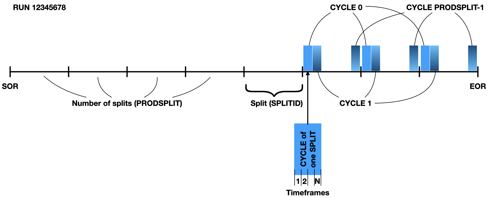
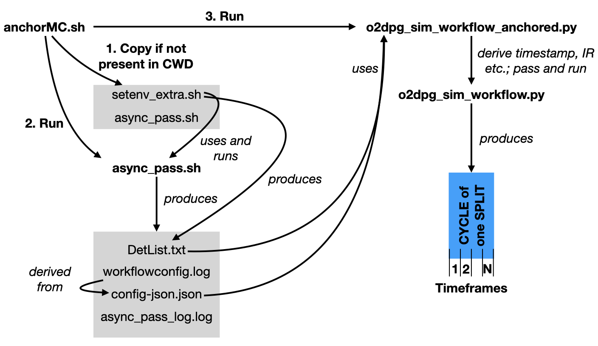

# Anchored MC

!!! warning ""

  Note that anchoring MCs are currently not supported on Mac!


In "anchored" MC simulations, conditions are set to match those during a real data taking run at a given time such as LHC filling scheme, included ALICE detectors, interaction rate etc.
Anchored MC productions are crucial for physics analyses to have realistic simulated samples.

An anchored simulation is bound to a run which is identified by a run number. A run in turn spans from the start-of-run (SOR) to the end-of-run (EOR). This is sketched in the figure.


One anchored simulation run corresponds to one specific `CYCLE` of one `SPLITID` and contains a given number of timeframes as indicated by the big blue box on the bottom right.
A full `RUN` is covered when all `CYCLES` have been produced for all `SPLITIDS`.

There are two examples for anchored simulations:

* [PbPb](https://github.com/AliceO2Group/O2DPG/blob/master/MC/run/ANCHOR/tests/test_anchor_2023_apass2_PbPb.sh),
* [pp](https://github.com/AliceO2Group/O2DPG/blob/master/MC/run/ANCHOR/tests/test_anchor_2023_apass2_pp.sh).

It is possible to pass additional arguments that will affect the simulation workflow creation via the environment variable `ALIEN_JDL_ANCHOR_SIM_OPTIONS`.
For instance, to run an `external` generator that is configured via an `ini` file, in addition to the other environment variables in the above examples, do also
```bash
export ALIEN_JDL_ANCHOR_SIM_OPTIONS="-gen external -ini <path/to/config.ini>"
```

## Run Pythia with a different collision system

If you need to run Pythia8 with a different collision system than the one during data taking, you can make use of the above method as well.
As a first step, you need to provide your custom `cfg` file for Pythia8. For examples, please have a look [here](https://github.com/AliceO2Group/AliceO2/tree/dev/Generators/share/egconfig).
Then, configure it via
```bash
export ALIEN_JDL_ANCHOR_SIM_OPTIONS="-gen pythia8 -confKey GeneratorPythia8.config=<pth/to/pythia_config.cfg>"
```

Such a configuration can also be build by using the [`mkpy8cfg.py`](https://github.com/AliceO2Group/O2DPG/blob/master/MC/config/common/pythia8/utils/mkpy8cfg.py).
For instance, you could run that first to produce your configuration and pass it on. Here is an example
```bash
${O2DPG_ROOT}/MC/config/common/pythia8/utils/mkpy8cfg.py --output pythia8.cfg --seed 5 --idA 2212 --idB 2212 --eCM 5020 --process jets

# required ALIEN_JDL_* variables
export ALIEN_JDL_ANCHOR_SIM_OPTIONS="-gen pythia8 -confKey GeneratorPythia8.config=pythia8.cfg"

# the following are example values
export NTIMEFRAMES=2
export NSIGEVENTS=50
export SPLITID=100
export PRODSPLIT=153
export CYCLE=0

# on the GRID, this is set, for our use case, we can mimic any job ID
export ALIEN_PROC_ID=2963436952

# run the central anchor steering script; this includes
# * derive timestamp
# * derive interaction rate
# * extract and prepare configurations (which detectors are contained in the run etc.)
# * run the simulation (and QC)
${O2DPG_ROOT}/MC/run/ANCHOR/anchorMC.sh
```

In addition to the collision system, one can also influence other parameters, like in this case the centre-of-mass energy.

## Behind the scenes

The procedure steered behind the scenes is quite involved. The following figure shall provide some overview.


